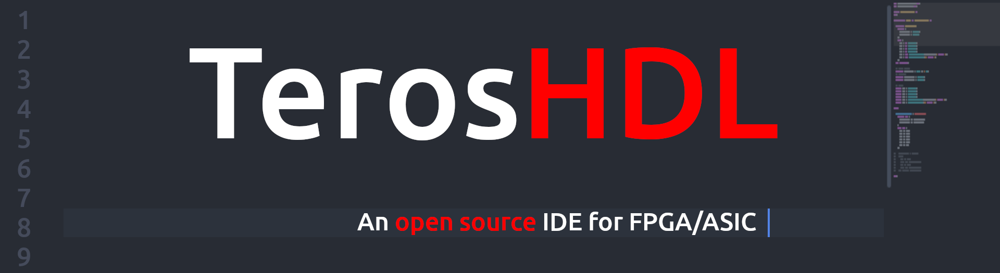

<!--  -->

# TerosHDL command line

Command line version of TerosHDL (https://terostechnology.github.io). Current features:

- Documenter.

## Requirements

- nodejs >= v12.0.0

## Installation


- Installation from NPM:

```
npm install -g teroshdl
```

- From sources:

```
sudo npm install .
```

## Documentation

Full documentation: https://terostechnology.github.io/terosHDLdoc/documenter/command_line.html


## Getting started


- Arguments

```
-i, --input [path], Directory with the HDL files, path of the YML (with EDAM format) file for documenter or CSV. Check the documentation for more information
-o, --out [type], Documentation format: md, html (default: "markdown")
--dep, --dep', Include dependency graph in the documentation
--fsm, --fsm', Include finite state machines in the documentation
-s, --signals , Include signals/regs/wires in the documentation ['none', 'all', 'only_commented']
-c, --constants , Include constants/types in the documentation ['none', 'all', 'only_commented']
-p, --process , Include process/always in the documentation ['none', 'all', 'only_commented']
--sym-verilog, --symbol_verilog , Special character to parse comments into documentation
--sym-vhdl, --symbol_vhdl , Special character to parse comments into documentation
--pypath, --python_path , Explicit python path
--outpath, --outpath , Explicit outputh documentation path
--self, --self_contained , Documentation generated in a single file for html output
```

## Examples

**Documenter with teros project manager file or EDAM file**

Check the EDAM format: https://edalize.readthedocs.io/en/latest/edam/api.html

```
cd /bin/example/doc
teroshdl-hdl-documenter -i example_edam.yml -o markdown
teroshdl-hdl-documenter -i example_edam.yml -o html
teroshdl-hdl-documenter -i example.csv -o html
teroshdl-hdl-documenter -i ../rtl -o html
```
