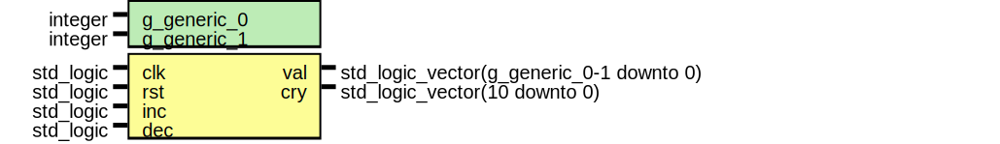

# Entity: structure
## Diagram

## Description
 Description entity
## Generics and ports
### Table 1.1 Generics
| Generic name | Type    | Value | Description          |
| ------------ | ------- | ----- | -------------------- |
| g_GENERIC_0  | integer |       |                      |
| g_GENERIC_1  | integer |       |  Description generic |
### Table 1.2 Ports
| Port name | Direction | Type                                       | Description       |
| --------- | --------- | ------------------------------------------ | ----------------- |
| clk       | in        | std_logic                                  |                   |
| rst       | in        | std_logic                                  |                   |
| inc       | in        | std_logic                                  |  Description port |
| dec       | in        | std_logic                                  |                   |
| val       | out       | std_logic_vector(g_GENERIC_0 - 1 downto 0) |                   |
| cry       | out       | std_logic_vector(10 downto 0)              |                   |
