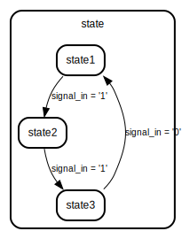

# Entity: example
## Diagram

## Description
 module description
## Generics and ports
### Table 1.1 Generics
### Table 1.2 Ports
| Port name  | Direction | Type      | Description                    |
| ---------- | --------- | --------- | ------------------------------ |
| clk        | in        | std_logic |  clk input --- clk second line |
| signal_in  | in        | std_logic |  signal in                     |
| signal_out | out       | std_logic |  signal out                    |
## Signals, constants and types
### Signals
| Name  | Type    | Description |
| ----- | ------- | ----------- |
| state | t_state |             |
### Types
| Name    | Type                     | Description |
| ------- | ------------------------ | ----------- |
| t_state | (state1, state2, state3) |             |
## Processes
- **stm**: ***( clk )***

## State machines
